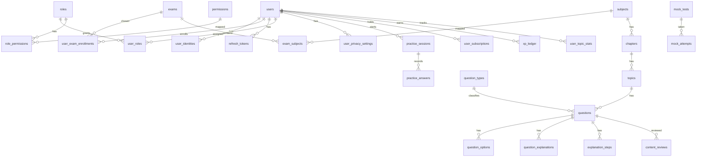

# Entity-relationship diagram

Core student and content model. Full columns: [DATABASE.md](DATABASE.md).



## Content hierarchy

```text
Exam
 └── Subject
      └── Chapter
           └── Topic
                └── Question
                     ├── Options (is_correct never in student fetch)
                     ├── Explanations (simple, detailed, why-wrong, tip)
                     └── Steps (formula → substitution → calculation → answer)
```

Question types are rows in `question_types` (`SINGLE_MCQ`, `MULTI_MCQ`, `NUMERICAL`, `TRUE_FALSE`, plus future codes). The UI renders from type metadata, not hard-coded enums in widgets.
